# YT-DLP archive scripts

**Local operator** workspace for **yt-dlp**-oriented archiving—**`monthly_*.bat`** drivers, **`yt-dlp.conf`**, cookies, and per-run reports—not a generic download manager. **Archive Console** is the optional localhost UI for this repo; **not affiliated with yt-dlp** (you provide installs, scripts, and config).

**Supported batch drivers (PRIMARY):** exactly three — **`monthly_watch_later_archive.bat`**, **`monthly_channels_archive.bat`**, **`monthly_videos_archive.bat`** — each runs the matching `archive_*_run.py` stack (manifest, verification, per-run `logs\archive_run_*`, `report.html`). **Legacy filenames** (**`archive_playlists_advanced.bat`**, **`archive_youtube_channels.bat`**, **`archive_videos.bat`**, **`archive_channels_robust.bat`**) are **compatibility shims**: they `call` the corresponding **`monthly_*`** driver and forward the exit code (see **`BAT_FILES.md`** and **`BAT_AUDIT.md`**).

**Public / GitHub snapshot:** some minimal trees may ship **placeholder** `archive_playlists.bat` / `archive_playlists_robust.bat` / `archive_channels.bat` that **only print a message and `exit /b 2`** (no job). Those are **not** supported archive entrypoints — use the **`monthly_*`** names or the **WRAPPER_FORWARD** stubs above.

Personal **YouTube (and batch URL)** download workspace built around **yt-dlp**, a **shared config**, and three **Python-backed** “monthly” drivers that share the same verification and logging model.

## Quick start

| Job | Run | Input file | Archive / skip list | Where files go | Latest run pointer |
|-----|-----|------------|---------------------|----------------|-------------------|
| **Watch Later / playlists** | `monthly_watch_later_archive.bat` | `playlists_input.txt` | `playlists_downloaded.txt` | `playlists\` | `logs\latest_run.txt` |
| **Whole channel(s)** | `monthly_channels_archive.bat` | `channels_input.txt` | `channels_downloaded.txt` | `channels\` | `logs\latest_run_channel.txt` |
| **List of video URLs** | `monthly_videos_archive.bat` | `videos_input.txt` | `videos_downloaded.txt` | `videos\` | `logs\latest_run_videos.txt` |
| **One-off (single URL)** | Archive Console **One-off** tab or optional `oneoff_archive.bat` | URL in UI / `ARCHIVE_ONEOFF_URL` | `oneoff_downloaded.txt` | `oneoff\` (or `ARCHIVE_OUT_ONEOFF`) | `logs\latest_run_oneoff.txt` |

Rolling operator report: **`logs\oneoff_report\`** (`summary.jsonl`, `report.html`; retention/rotation from Settings). Working directory should be this folder (where **`yt-dlp.conf`** and the `*_input.txt` files live).

**Stub aliases** (deprecation message then same flow): `archive_playlists_advanced.bat`, `archive_youtube_channels.bat`, `archive_videos.bat`, `archive_channels_robust.bat` → see **`BAT_FILES.md`** for exact targets. Prefer renaming shortcuts and Scheduled Tasks to the **`monthly_*`** names when you can.

## How this differs from the “years of .bat files” setup

**Before:** many one-off `.bat` files calling **`python -m yt_dlp`** directly, immediate writes to `--download-archive`, little or no per-run provenance, and no consistent post-download file verification.

**Now:**

- **Three PRIMARY batch entrypoints** call **`archive_playlist_run.py`**, **`archive_channel_run.py`**, and **`archive_video_run.py`** (shared helpers from `archive_playlist_run`: manifest, issues, merged-file-aware verification, deferred archive sync).
- **One shared** **`yt-dlp.conf`** (cookies, sleeps, formats, EJS/`--js-runtimes node`, etc.).
- Optional **pip self-upgrade** (`python -m pip install --upgrade pip`) when **`SKIP_PIP_UPDATE`** is not **`1`** (double-click runs default to skip; **Archive Console** can uncheck **Skip pip update**). Then **pip** **`yt-dlp[default]`** on each run (unless **`SKIP_YTDLP_UPDATE=1`**) so **yt-dlp-ejs** stays aligned for YouTube challenges.
- **`youtube <id>`** lines hit **`*_downloaded.txt`** only after a row is **verified** on disk (merged `.mkv` / final name handling matches the playlist driver behavior).
- Each run writes **`logs\archive_run_<UTC>\`** with **`manifest.csv`**, **`issues.csv`**, **`summary.txt`**, **`report.html`**, **`rerun_urls.txt`**, **`run.log`**, and a **`COUNT_CHECK`** line when internal counts agree.
- **Separate** **`latest_run*.txt`** files so playlist, channel, and video-list runs do not overwrite each other’s “open this report” pointer.

Full list of every project `.bat`, **PRIMARY** vs **WRAPPER_FORWARD** vs **launchers**, and snapshot caveats: **`BAT_FILES.md`**. Line-level classification: **`BAT_AUDIT.md`**.

## Operator checklist

Cookies, Node/EJS, dry-run, pip skip, and failure families are **long**; they are maintained in **`ARCHIVE_PLAYLIST_RUN_LOGS.txt`** (playlist + channel + video-list sections, cookie heuristics, monthly checklist). Read that file before changing **`yt-dlp.conf`** or debugging a run.

Typical env toggles (all three monthly drivers):

- **`SKIP_PIP_UPDATE=1`** — skip pip self-upgrade (`pip` is left as-is).
- **`SKIP_YTDLP_UPDATE=1`** — skip **`yt-dlp[default]`** pip upgrade.
- **`ARCHIVE_DRY_RUN=1`** — pass **`--simulate`** (config test; not a full substitute for a real run).
- **`ARCHIVE_PAUSE_ON_COOKIE_ERROR=1`** / **`ARCHIVE_COOKIE_AUTH_POLL_*`** — optional pause when auth-like errors appear; details in the log doc.

Channels only: **`ARCHIVE_CHANNEL_EXPAND_TABS=0`** — disable auto-split of bare channel home URLs into `/videos` + `/shorts`.

**Console styling** (playlist / channel / video Python drivers): on an interactive Windows console, drivers enable **virtual-terminal** coloring for stage headers, **`ARCHIVE_DRY_RUN`** notices, cookie-auth **pause banners** (when enabled), selective **yt-dlp** line emphasis (errors, warnings, archive skips—lines that already use ANSI, e.g. progress, are unchanged), and a **final green/red summary** with exit code and paths. Monthly **`.bat`** files call **`archive_print_role.py`** for pip skip / success / warning lines so those outcomes match the same palette. Files under **`logs\archive_run_*`** stay **plain text**: **`run.log`** never receives escape codes; a plain **outcome block** is appended there at the end of each run. **Turn off colors:** **`NO_COLOR=1`**, **`ARCHIVE_PLAIN_LOG=1`**, or run with stdout **redirected** (not a TTY). **pip noise:** monthly **`.bat`** entrypoints pass **`-q`** to pip unless **`ARCHIVE_PIP_VERBOSE=1`** (full install output). Implementation: **`archive_run_console.py`** + **`archive_print_role.py`** (no Rich/colorama).

**Progress readability:** **`yt-dlp.conf`** may include **`--verbose`**, which adds many `[debug]` lines and can make the main download progress harder to scan. Comment out **`--verbose`** there if you prefer a quieter console (same download behavior).

## Troubleshooting

If a run exits non-zero or counts look wrong, open **`logs\latest_run.txt`**, **`logs\latest_run_channel.txt`**, or **`logs\latest_run_videos.txt`** (whichever pipeline you used), then that folder’s **`report.html`** and **`issues.csv`**. The remediation text and **`run.log`** (including **`COUNT_CHECK`**) are the first sources of truth. **`regenerate_report.bat`** / **`python regenerate_report.py <run_folder>`** can refresh reports after you fix files on disk. For **`yt-dlp.conf`** and cookie strategy, read the header comments and **`ARCHIVE_PLAYLIST_RUN_LOGS.txt`**.

## File map

| Path | Role |
|------|------|
| **`BAT_FILES.md`** | Complete `.bat` catalog (PRIMARY vs WRAPPER_FORWARD, launchers, snapshot caveat). |
| **`BAT_AUDIT.md`** | Line-cited classification audit and cleanup checklist. |
| **`CLEANUP_PR.md`** | Record of safe repo cleanups (deleted paths, reasons, reference checks). |
| **`ARCHIVE_PLAYLIST_RUN_LOGS.txt`** | Operator manual: artifacts, verification rules, env vars, troubleshooting. |
| **`yt-dlp.conf`** | Shared yt-dlp flags. |
| `archive_playlist_run.py` / `archive_channel_run.py` / `archive_video_run.py` | PRIMARY Python drivers. |
| `archive_run_console.py` / `archive_print_role.py` | TTY coloring for drivers and monthly `.bat` pip summaries. |
| `regenerate_report.py` / `repair_playlist_download_archive.py` | Utilities (repair is playlist-archive oriented today). |

**Migration note:** If anything **outside** this repo still targets **`archive_playlists_advanced.bat`**, **`archive_youtube_channels.bat`**, **`archive_videos.bat`**, or **`archive_channels_robust.bat`**, either keep those files (they forward to **`monthly_*`**) or update those launchers and then remove the stubs per **`BAT_FILES.md`**.

## Archive Console (optional UI)

Local **127.0.0.1** panel with live logs, allowlisted file browse, **yt-dlp.conf** nav (interactive Tier A/B **`yt-dlp.conf`** editor + presets — same file on disk as the **`monthly_*`** bats), **gallery-dl.conf** nav (raw JSON for **Galleries** / **gallery-dl**), **Supported sites** (read-only lists from your **`yt-dlp`** / **`gallery-dl`** `--list-extractors` installs, links to official docs), **Inputs & config** editing for `*_input.txt` / raw `yt-dlp.conf` (optional locked **`cookies.txt`**), per-pipeline **download output folders** (same relative roots the **`monthly_*`** jobs use), **One-off** single-URL downloads (**`archive_oneoff_run.py`**, same run mutex as **`monthly_*`**), **Galleries** (**`archive_gallery_run.py`** + **`gallery-dl`**, preview **`POST /api/galleries/preview`**), rolling report under **`logs/oneoff_report/`**, and report links. In the usual layout (archive root = scripts folder next to **`archive_console/`**), **One-off** uses **`archive_console/.venv/Scripts/python.exe`**—not bare **`python`**—and **`archive_console/requirements.txt`** includes **`yt-dlp[default]`** **and** **`gallery-dl`** so **`import yt_dlp`** and the Galleries tab match that venv after **`pip install -r requirements.txt`**. Optional root **`gallery-dl.conf`** is passed as **`-c`** when present ([gallery-dl configuration](https://github.com/mikf/gallery-dl/blob/master/docs/configuration.rst)). Coexists with **`BAT_FILES.md`** (authoritative `.bat` list); the console spawns the three **`monthly_*`** drivers, **One-off**, and **Galleries** via Python/batch as documented in **`archive_console/ARCHIVE_CONSOLE.md`**. **Library** tab includes an **in-page HTML5 player** (playlist, shuffle, loop) that streams allowlisted media via **`/reports/file`** with range support—same trust boundary as **Open**, not **`file://`**—plus optional **local clip export** (**ffmpeg** on the console host; independent of the download run mutex). GIF export uses ffmpeg’s **palette** workflow; prefer **MP4/WebM** for quality. **Not affiliated with YouTube, Google, or the yt-dlp project**—you are responsible for site terms and compliance. Details: **`archive_console/ARCHIVE_CONSOLE.md`**.

### Which launcher? (Windows)

- **Tray — no lingering console:** **`start_archive_console_tray.bat`** finishes **`pip`** (a **cmd** window may appear briefly on first run), then starts **`tray_app.py`** with **`.venv\Scripts\pythonw.exe`** detached so **Explorer double-click** does not leave a **`cmd.exe`** open. **Spawn mode:** **Exit** or **Settings → Stop** ends the server and the tray icon exits with it. **Attach mode** (tray joined an already-running server): **Settings → Stop** stops uvicorn but you still use **Exit** to remove the tray.
- **Dev / server logs in a terminal:** **`start_archive_console.bat`** from **Cursor** or **cmd** — keep the **`Archive Console (uvicorn)`** window or set **`ARCHIVE_CONSOLE_ATTACHED=1`** so uvicorn stays in the **current** terminal (unchanged contract).

### Cookies (`cookies.txt`)

Archive Console **does not** automate the browser or silently export cookies. You maintain **`cookies.txt`** in the **same folder as `yt-dlp.conf`** (repo / archive root next to the **`monthly_*.bat`** files), or use other cookie mechanisms documented in **`yt-dlp.conf`** / **`ARCHIVE_PLAYLIST_RUN_LOGS.txt`**. For workflows that rely on **Firefox** (or another browser) staying logged into **YouTube**, session cookies can **expire quickly**—refresh the file when downloads start failing auth-style errors.

### Manual Run: pause and confirm cookies (default on)

When **Settings → Cookie hygiene** has **Require cookie confirmation before each manual run** enabled (default), **Run WL / channels / videos** opens a dialog (**Confirm cookies before run**) that explains **Netscape-format** export for **youtube.com** and saving as **`cookies.txt`** via **Inputs & config**. The server **does not** spawn the batch until you check **I’ve updated cookies.txt** and click **Continue**; **Cancel** aborts cleanly. The API uses **HTTP 428** with **`cookie_confirm_required`** until confirmed. **Dry-run** skips this gate so you can simulate without the modal. **In-process scheduled** runs are **not** blocked by this gate (operator may be away); they rely on in-app banners and optional tray notifications instead.

### Scheduled runs: tray balloon (optional)

With **Notify via tray …** enabled in **Cookie hygiene** and **`tray_app.py`** (or **`start_archive_console_tray.bat`**) running, the console POSTs to a **localhost-only** notify endpoint during the **pre-run reminder window**: from **N minutes before** the **earliest upcoming enabled schedule** until **just before** that run’s kickoff (local clock—the same rule as the pre-run banner). **`pystray`** shows a taskbar balloon; open the console from the tray menu if you need the UI. If the tray is **not** running, you still get **server logs**, optional **last tray notify** status in Settings, and the **web banner** when the browser is open—not a Windows toast from the server alone.

### Cookie hygiene settings (no multi-day “snooze” promise)

Reminder UI uses **short snoozes** (e.g. **15 min** on the Run banner, **1 h / 3 h** in Settings) and an optional **N-day** nudge (**capped**; copy treats it as a low-priority hint, **not** a claim that cookies last that long). There is **no** “snooze 7 days” control. See **`archive_console/ARCHIVE_CONSOLE.md`**.

### Run

1. From the folder that contains **`start_archive_console.bat`** (this repo’s scripts root), double-click **`start_archive_console.bat`**, or run it from an IDE terminal.
2. On first run it creates **`archive_console\.venv`** and installs **`archive_console\requirements.txt`** (includes optional **tray** deps: **pystray**, **Pillow**).
3. **By default** uvicorn starts in a **new** window titled **`Archive Console (uvicorn)`** — look on the taskbar even if you launched from **Cursor**; the IDE terminal should return right away.
4. Your browser should open to **`http://127.0.0.1:<port>/`** (default **8756**; see **`archive_console\state.json`** / **`print_bind.py`**).
5. If **`/api/health`** already succeeds on that port, the batch **only opens the browser** (no second server).
6. **Integrated terminal only:** set **`ARCHIVE_CONSOLE_ATTACHED=1`** before running the batch so uvicorn stays in **that** window (**Ctrl+C** stops it). Example: `set ARCHIVE_CONSOLE_ATTACHED=1` then `start_archive_console.bat`.
7. **Optional tray:** **`start_archive_console_tray.bat`** — same venv/`pip` as above, then **`pythonw`** tray (**no** persistent console when double-clicked in Explorer). Menu: **Open UI**, **Open logs folder**, **Restart server**, **Quit**. See **`archive_console/ARCHIVE_CONSOLE.md`**.

### Stop

- **Closing the browser tab does not stop the backend.** Use **Settings → Danger zone → Stop Archive Console server** (confirm `SHUTDOWN`), **Ctrl+C** / close **`Archive Console (uvicorn)`**, tray **Quit**, or **`archive_console\stop_server.ps1`**. See **`archive_console/ARCHIVE_CONSOLE.md`** for **`POST /api/shutdown`** and optional **`ARCHIVE_SHUTDOWN_TOKEN`**.
- **From Cursor** without a dedicated window, either use **`ARCHIVE_CONSOLE_ATTACHED=1`** and **Ctrl+C** in that terminal, or run **`archive_console\stop_server.ps1`** (narrow uvicorn-only kill). **`archive_console/start_archive_console.bat`** is a thin wrapper that **`call`**s the root launcher from **`archive_console\..`**.

### Port / “already in use”

If the port is listening but **health** fails, the launcher **prompts** to kill the old listener (or set **`ARCHIVE_CONSOLE_REPLACE=1`**). Safe kill script: **`archive_console\stop_server.ps1`**. For port conflicts with **other** apps, change **`port`** in **`state.json`** — see **`archive_console/ARCHIVE_CONSOLE.md`**.

### Console install notes (Python & CLIs)

- **Python:** **3.10+** on PATH for **`start_archive_console.bat`** to create **`archive_console\.venv`**.
- **Pinned in venv:** **`yt-dlp[default]`** and **`gallery-dl`** from **`archive_console/requirements.txt`** — health reports whether **`gallery-dl`** resolves (including next to **`python.exe`** under **`.venv\Scripts`** on Windows).
- **System tools (optional):** **ffmpeg** / **mediainfo** / **exiftool** for Library clip export, media info, and Rename — configure under **Settings → General** if not on PATH.

### UI at a glance (screenshots)

Captured at **1280×800** viewport, default dark theme. If you publish **`README.md`**, replace these images when they show a machine-specific **archive root** or editor content you do not want public.

| Section | What it is |
|--------|------------|
| **Run** | **`monthly_*`** drivers, env toggles, live log. |
| **One-off** | Single URL **`archive_oneoff_run.py`**, rolling report links. |
| **Galleries** | **`gallery-dl`** batch + preview; optional **`gallery-dl.conf`**. |
| **History & reports** | Run ledger, open **`report.html`** via safe URLs. |
| **Library** | Allowlisted browse, player, duplicates, clip export. |
| **Rename** | DeepL / ExifTool rename preview. |
| **Inputs & config** | Download output folder roots + tabbed raw editors (**`cookies.txt`** gated). |
| **yt-dlp.conf** | Tier A/B/C interactive editor (same file as batches). |
| **gallery-dl.conf** | JSON editor for **`-c`** ([upstream docs](https://github.com/mikf/gallery-dl/blob/master/docs/configuration.rst)). |
| **Supported sites** | Cached **`--list-extractors`** for **yt-dlp** and **gallery-dl**. |
| **Settings** | Port (**127.0.0.1** only), allowlist, cookie hygiene, scheduler, retention, shutdown. |

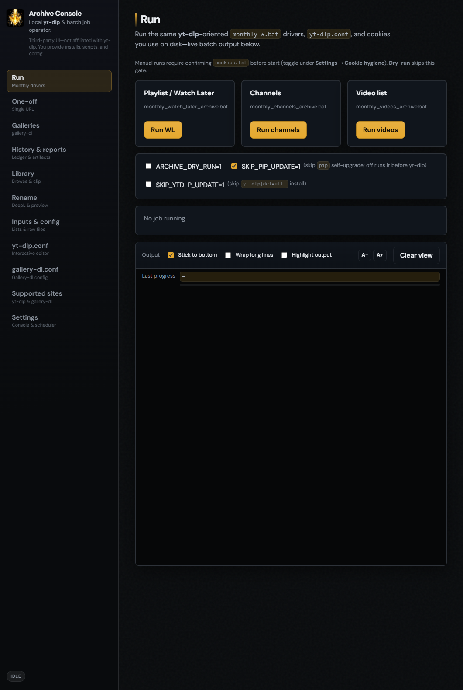

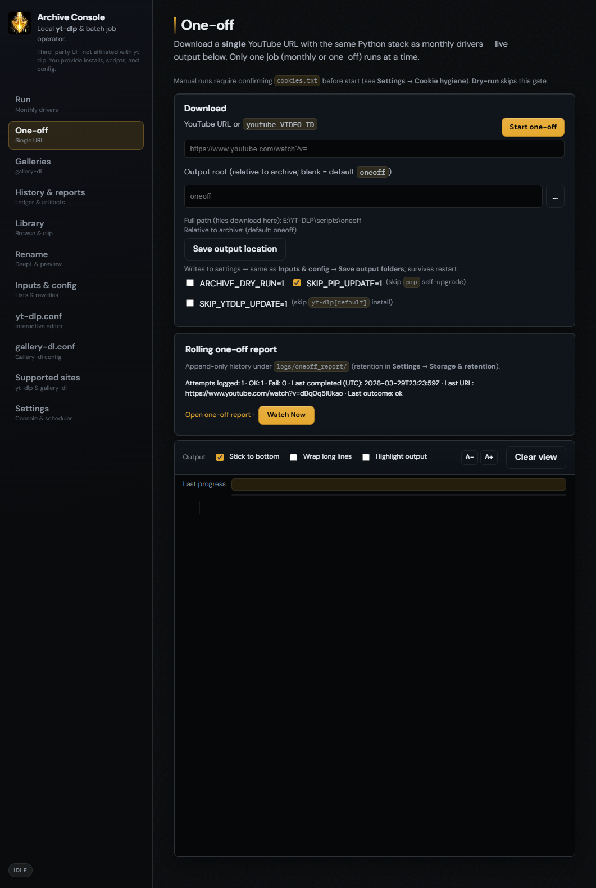

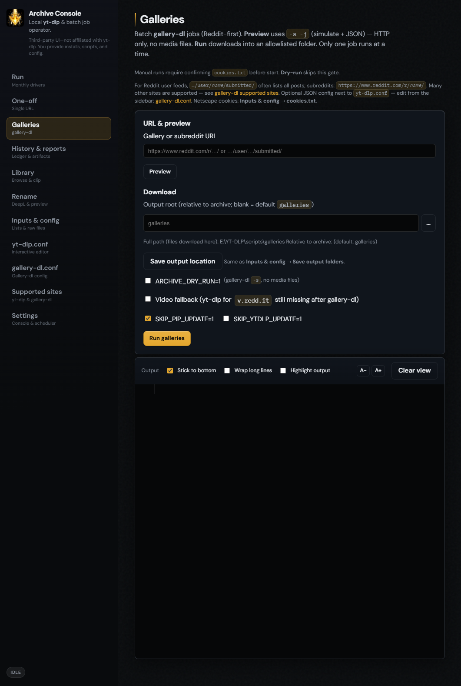

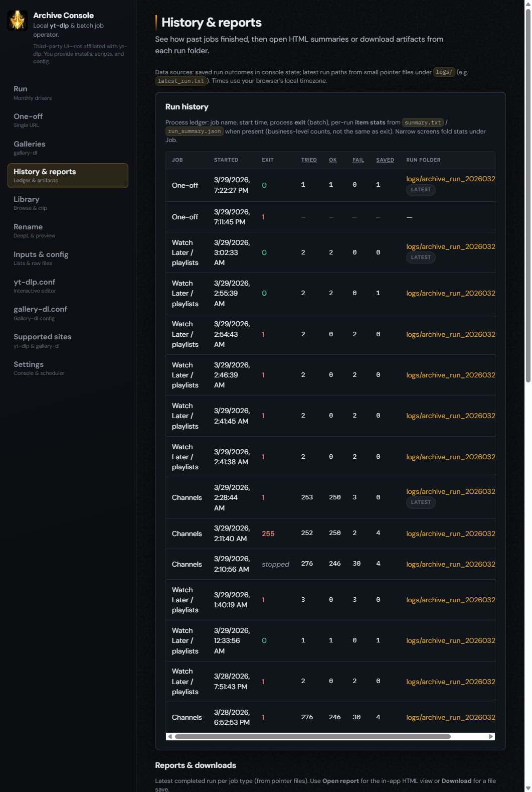

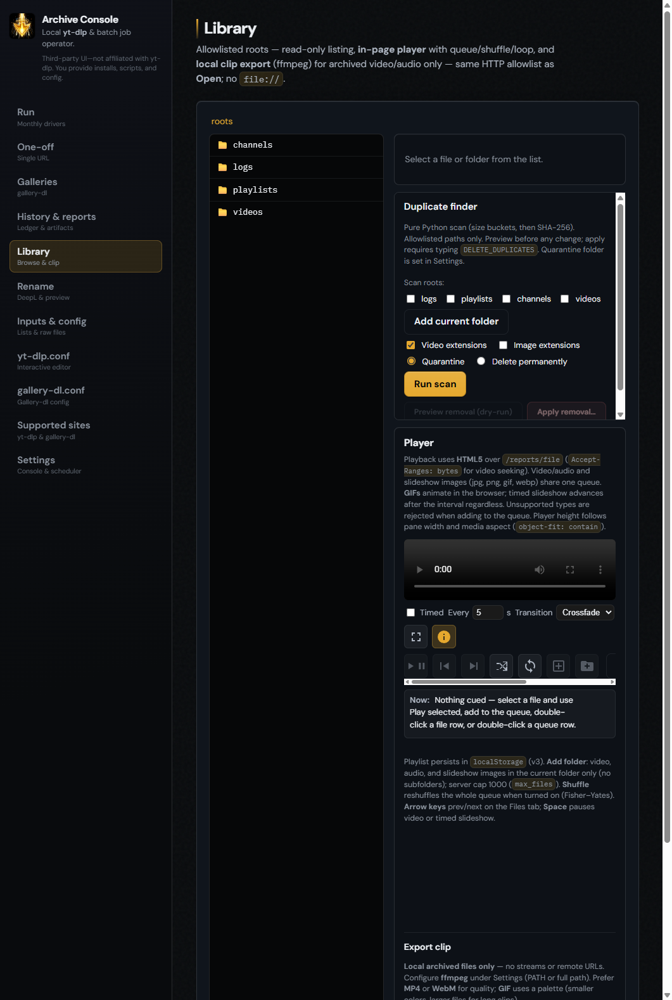

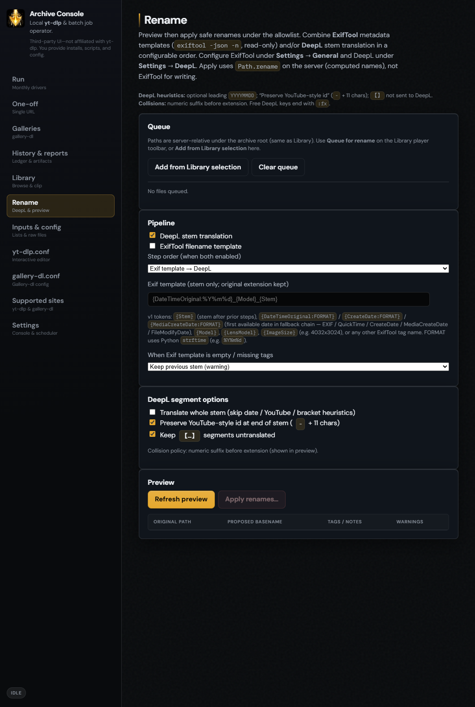

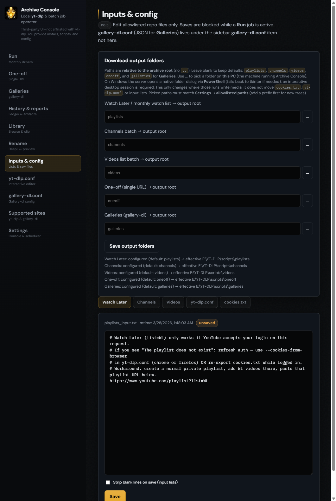

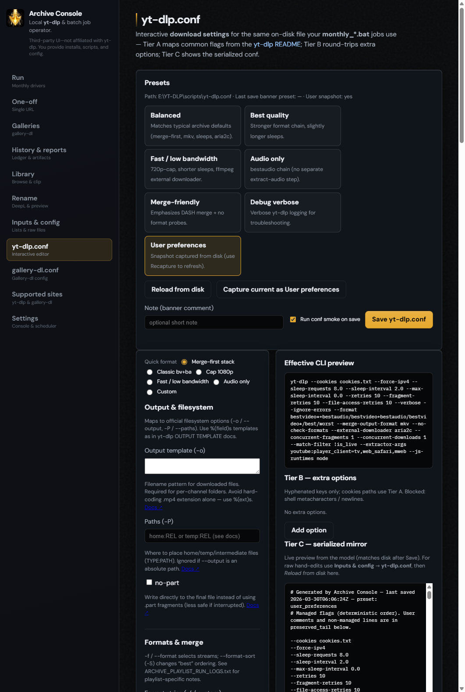

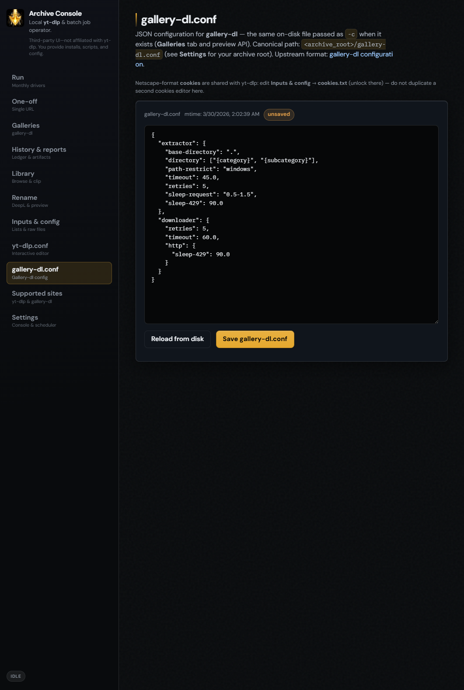

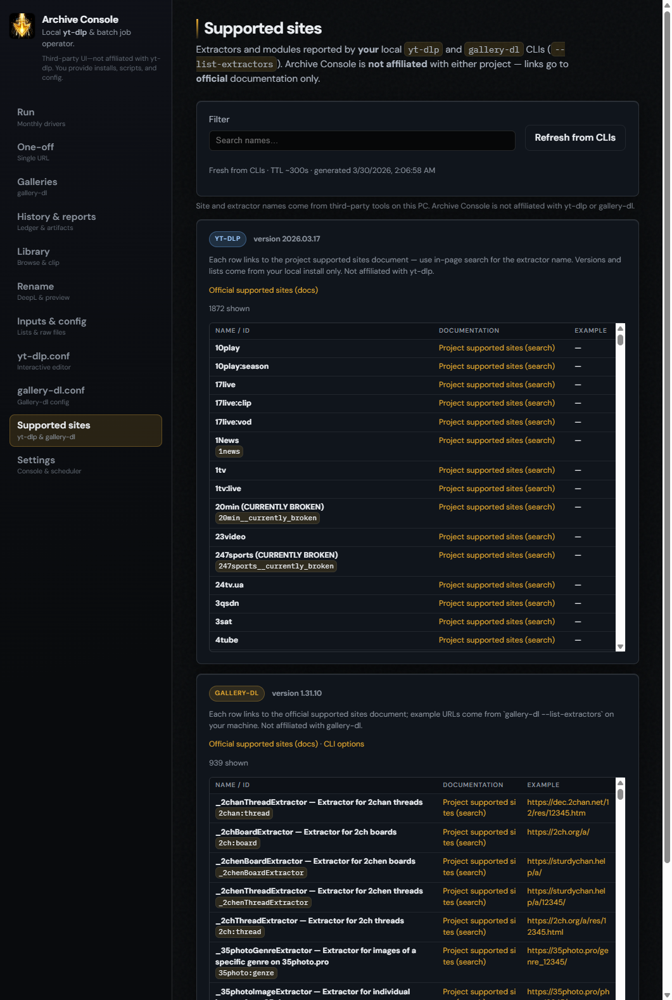

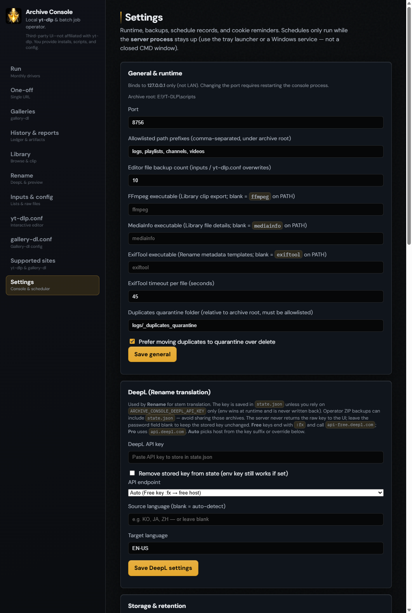

### Publish / staging tree (sanitized copy)

Idempotent export (redacts obvious user-profile paths, skips **`cookies.txt`**, **`state.json`**, download trees): from repo root run **`python tools\publish_staging.py`**. Default output is a sibling folder named like **`scripts__publish_staging`** next to your source tree (see script **`--dest`**). If removing the old staging folder fails on Windows (**`PermissionError`** on **`.git`**), close apps locking that tree or publish to a fresh **`--dest`** path and swap folders when convenient. **`PUBLISH_MANIFEST.md`** inside the staging root lists included/excluded paths.

### Recent UI features (audit summary)

| Feature | Entry | Happy path | Gaps / untested |
|--------|--------|------------|-------------------|
| **Galleries** | Sidebar **Galleries** | Preview (**`-s -j`**), then Run into allowlisted **`galleries/`** (or overridden root). | Long Reddit / rate-limit runs not re-tested every release. |
| **gallery-dl.conf** | Sidebar **gallery-dl.conf** | Edit JSON → Save; driver passes **`-c`** when file exists. | Exotic per-site keys left to operator ([configuration.rst](https://github.com/mikf/gallery-dl/blob/master/docs/configuration.rst)). |
| **Supported sites** | Sidebar **Supported sites** | Search + **Refresh from CLIs** (uses local **yt-dlp** / **gallery-dl**). | List cache TTL (~5 min) only; extractor rows depend on installed versions. |
| **Download output dirs** | **Inputs & config** (top card) | Set relative roots → **Save output folders**; paths must stay allowlisted. | Browse dialog needs interactive desktop on Windows. |
| **Health: gallery-dl** | **`GET /api/health`** | `gallery_dl_on_path` reflects resolvable **`gallery-dl`**. | Alternate **`gallery_dl_exe`** overrides not screenshot-tested here. |

**Security posture (sanity):** server binds **loopback**; **`/reports/file`** and APIs enforce **archive-root allowlist**; **`cookies.txt`** is blocked from report file serve; manual Run uses **HTTP 428** cookie confirm unless dry-run; shutdown requires typed confirm (**`SHUTDOWN`**) and optional token — see **`ARCHIVE_CONSOLE.md`**.

### Git / GitHub

This documentation and screenshots target the **scripts** tree that contains **`start_archive_console.bat`**. If your working copy has **no** **`.git`** (or Git lives only inside an export/staging clone), create commits and push your usual branch from the repository you use day-to-day; a bare file tree cannot report **branch / SHA / PR URL** without that clone.

---

## Public snapshot notes

- Replace machine-specific roots with `<ARCHIVE_ROOT>` in your mind: working directory is the folder that contains `yt-dlp.conf` and the `monthly_*.bat` files.
- Copy `*.sample.txt` to `channels_input.txt`, `playlists_input.txt`, and `videos_input.txt` before running batch jobs.
- See **`CONTRIBUTING.md`**, **`PUBLISH_MANIFEST.md`**, and **`cookies.txt.example`**.

**Third-party / disclaimer:** this project is **not affiliated with YouTube, Google LLC, or yt-dlp**. You supply yt-dlp and obey site terms of service.

