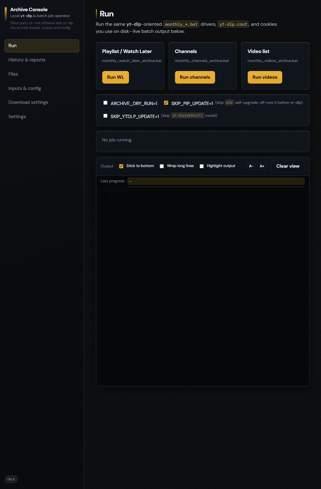
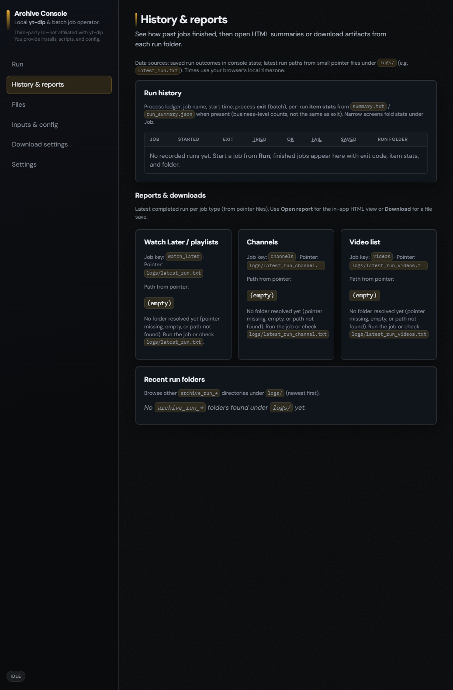
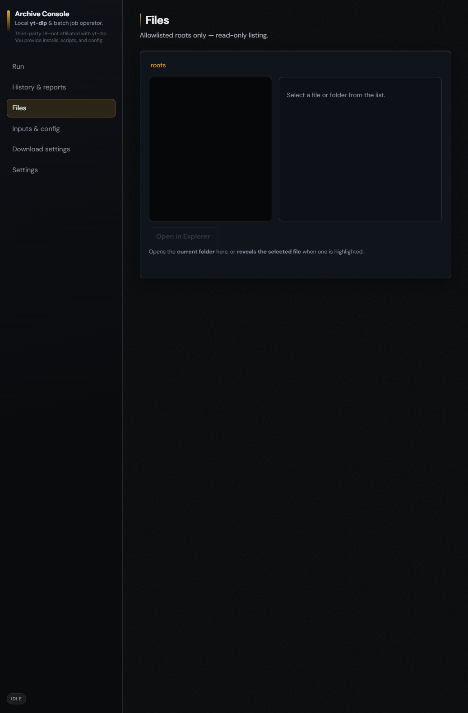
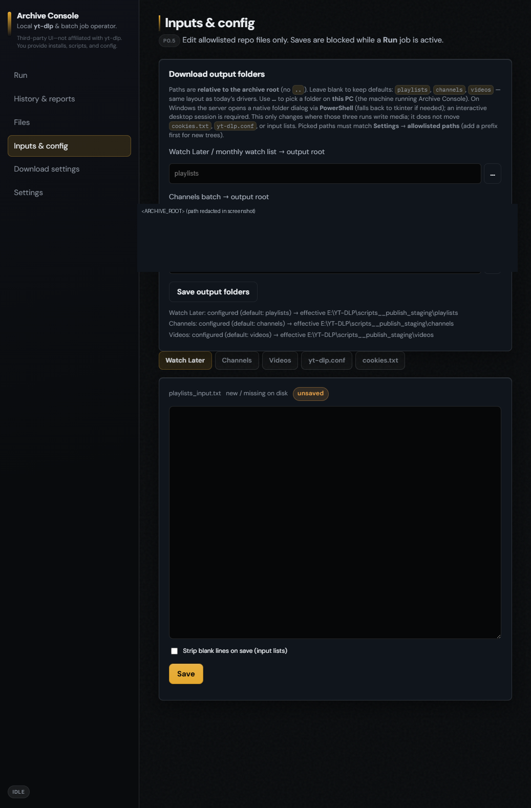
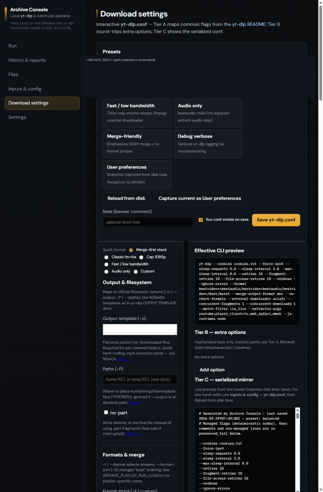
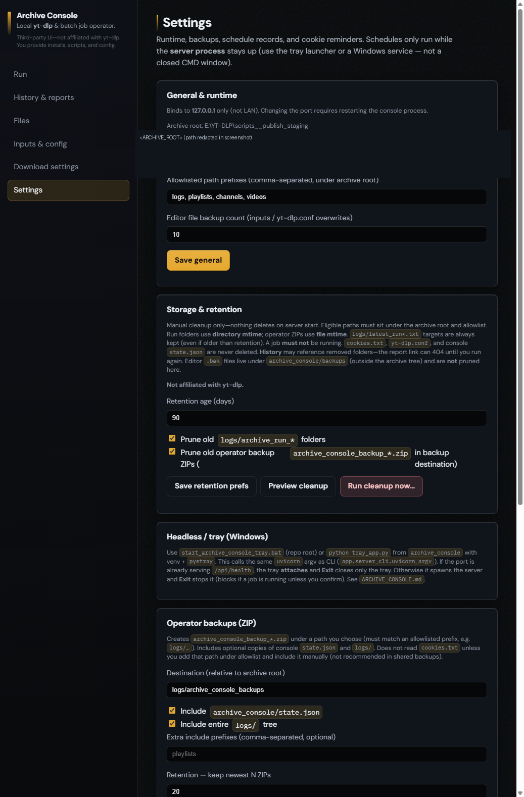

# Archive Console & yt-dlp archive drivers

This repo is **local operator tooling** for **yt-dlp–oriented** batch workflows on Windows: a **localhost Archive Console** (optional but central), an optional **system-tray helper** so the server (and in-process schedules) can stay up without a bare CMD window, plus **batch + Python drivers** designed for **end-to-end runs** you can **audit**—per-run folders, manifests, issue lists, HTML reports, and pointer files—not “we assume it worked.”

You bring **yt-dlp**, **Python**, and compliance with **site terms**; this tree does **not** ship secrets (no real `cookies.txt`; use [`cookies.txt.example`](cookies.txt.example)). **[`LICENSE`](LICENSE)** applies to the code and docs here.

## Screenshots

These are **static captures** from a **fresh Archive Console** session: demo `state` only, **no** real `cookies.txt`, **no** job started (so the Run log is empty—no live yt-dlp output or URLs). Some panels normally echo your real **archive root** or resolved paths; those strips are **overlaid** in the PNGs with a placeholder line so the repo stays free of machine-specific roots. *(PNG width ≈1040px—GitHub scales them; open the file for 1:1.)*

### Run

Primary dashboard: the three **`monthly_*.bat`** drivers, env toggles (`ARCHIVE_DRY_RUN`, pip/skip options), log controls, and an idle log pane.

### History & reports

Run ledger, per-job **reports / downloads** cards (pointer files under `logs/`), and recent `archive_run_*` folders.

### Files

Allowlisted **read-only** tree browser (`logs`, `playlists`, `channels`, `videos`, …).

### Inputs & config

Output-folder hints, tabbed editor for `*_input.txt`, `yt-dlp.conf`, and **locked** `cookies.txt` workflow.

### Download settings

Tiered **`yt-dlp.conf`** UI (presets, Tier A/B/C, CLI preview). Same file on disk the batch drivers use.

### Settings

Port / allowlist, **storage & retention**, **operator backups**, in-process **scheduling** toggles, **cookie hygiene** — plus the in-page **Headless / tray** instructions.

### Tray (Windows)

The tray app is **not** a web view; it ships with the repo (**`start_archive_console_tray.bat`** → **`tray_app.py`**). Motif used for the notification-area icon:

---

## Archive Console

**Archive Console** is a small **FastAPI** app with a browser UI, bound to **`127.0.0.1` only** (not LAN-exposed). It runs the same **`monthly_*.bat`** entrypoints the repo documents in **[`BAT_FILES.md`](BAT_FILES.md)**—no forked download logic.

**What you can do there** (see **[`archive_console/ARCHIVE_CONSOLE.md`](archive_console/ARCHIVE_CONSOLE.md)** for detail):

- **Run** — Start **`monthly_watch_later_archive.bat`**, **`monthly_channels_archive.bat`**, or **`monthly_videos_archive.bat`** with **live log streaming**, optional line highlighting, monospace sizing, and **Stop run** (Windows: targeted **cmd** tree kill). Console sets **`ARCHIVE_CONSOLE_UNATTENDED=1`** so interactive `pause` steps are skipped when launched from the UI.
- **History & reports** — Run ledger with links into **`report.html`** and related artifacts under the allowlisted archive tree.
- **Files** — Browse paths under an **allowlisted** prefix set (e.g. `logs/`, `playlists/`, …); traversal like `..` is rejected.
- **Inputs & config** — Edit **`playlists_input.txt`**, **`channels_input.txt`**, **`videos_input.txt`**, **`yt-dlp.conf`**, and operator-provided **`cookies.txt`** via API-backed editors (cookies default **locked** until explicitly unlocked). Optional download-dir fields map to env vars **`ARCHIVE_OUT_*`** on spawned runs.
- **Download settings** — Structured editor + presets for the **same** root **`yt-dlp.conf`** file the batch jobs use (single source of truth on disk).
- **Settings** — **Operator backups** (ZIP under an allowlisted path), **storage & retention** (manual preview/cleanup of old run folders / backup zips), **scheduling** (in-process **APScheduler** when `features.scheduler_enabled` is true—missed ticks after sleep/wake are **not** replayed), **cookie hygiene** / **pre-run reminders** (in-app prompts; **no** browser automation). **`features.notifications_stub`** is reserved for future use (no Windows toasts in core P0).

Full behavior, port conflicts, `stop_server.ps1`, and report URL rewriting: **`archive_console/ARCHIVE_CONSOLE.md`**.

---

## Tray and headless operation (Windows)

**Why:** In-process **schedules** only fire while the **uvicorn** process is running. Closing a one-off CMD window stops the server; the tray path keeps a small process alive with a menu (**Open UI**, **Open logs folder**, **Restart server**, **Quit**).

**How:** From `<ARCHIVE_ROOT>`, run **`start_archive_console_tray.bat`** (creates/uses **`archive_console\.venv`**, installs **`archive_console/requirements.txt`**, then runs **`tray_app.py`**). The tray can spawn or attach to the same **`http://127.0.0.1:<port>/`** session documented in **`ARCHIVE_CONSOLE.md`**.

**Also documented:** `ARCHIVE_CONSOLE_ATTACHED=1` keeps uvicorn in the **current** terminal instead of a separate window—useful from an IDE.

---

## Drivers, verification, and reliability

Three **PRIMARY** batch drivers share one **`yt-dlp.conf`**, optional pip / **`yt-dlp[default]`** upgrade steps, and the same **logging + verification** model (see **[`BAT_FILES.md`](BAT_FILES.md)** table):

| Pipeline | Batch | Python | Input list |
|----------|-------|--------|------------|
| Playlists / Watch Later | `monthly_watch_later_archive.bat` | `archive_playlist_run.py` | `playlists_input.txt` |
| Whole channels | `monthly_channels_archive.bat` | `archive_channel_run.py` | `channels_input.txt` |
| Video URL list | `monthly_videos_archive.bat` | `archive_video_run.py` | `videos_input.txt` |

The drivers aim for **complete, inspectable runs**: shared helpers defer **`--download-archive`** updates until **post-download verification** where that pattern applies, track **manifest / issues** data, and write **`report.html`**, **`summary.txt`**, **`manifest.csv`**, **`issues.csv`**, **`rerun_urls.txt`**, and plain **`run.log`** (disk logs stay **unstyled** even when the interactive console uses color). When internal counts line up, **`run.log`** can record a **`COUNT_CHECK`** line—still **your** signal to open **`issues.csv`** / **`report.html`** if something looks wrong.

**Env toggles** (also exposed from the Console Run tab): e.g. **`ARCHIVE_DRY_RUN=1`**, **`SKIP_PIP_UPDATE=1`**, **`SKIP_YTDLP_UPDATE=1`**, plus channel-only **`ARCHIVE_CHANNEL_EXPAND_TABS=0`**. Cookie pause / poll options are documented in **`ARCHIVE_PLAYLIST_RUN_LOGS.txt`**.

**Utilities:** **`regenerate_report.bat`** / **`regenerate_report.py`** rebuild reports from an existing run folder; **`verify_downloads.bat`** is a **legacy** file-count heuristic (see **`BAT_FILES.md`**). Stub **`archive_*.bat`** files forward to the **`monthly_*`** names for old shortcuts.

---

## Proof & logging (“what failed and why”)

Each run gets a timestamped folder:

- **`<ARCHIVE_ROOT>\logs\archive_run_<UTC>\`** — artifacts above plus any pipeline-specific outputs.
- **Pointers** (so playlist/channel/video runs do not clobber each other):
  - **`logs\latest_run.txt`** — playlist
  - **`logs\latest_run_channel.txt`** — channels
  - **`logs\latest_run_videos.txt`** — video list  

Open the pointer file for the job you ran, then **`report.html`**, **`issues.csv`**, and **`run.log`** in that folder. **`ARCHIVE_PLAYLIST_RUN_LOGS.txt`** is the long-form operator manual for failure families and cookie behavior.

---

## Quick start

1. Unzip or clone so **`<ARCHIVE_ROOT>`** is the directory containing **`yt-dlp.conf`**, the **`monthly_*.bat`** files, and **`archive_console\`**.
2. **Python 3.10+** on `PATH`. Install **yt-dlp** the way you prefer (e.g. `python -m pip install "yt-dlp[default]"`); **`yt-dlp.conf`** may reference **Node** or other runtimes depending on your flags—see your config and upstream yt-dlp docs.
3. Copy **[`channels_input.sample.txt`](channels_input.sample.txt)**, **[`playlists_input.sample.txt`](playlists_input.sample.txt)**, and **[`videos_input.sample.txt`](videos_input.sample.txt)** to **`channels_input.txt`**, **`playlists_input.txt`**, and **`videos_input.txt`** (or create your own lines).
4. Provide **`cookies.txt`** next to **`yt-dlp.conf`** using **[`cookies.txt.example`](cookies.txt.example)** as a guide, **or** adjust **`yt-dlp.conf`** for **`--cookies-from-browser`**—**never commit** real cookies.
5. Double-click **`start_archive_console.bat`** at `<ARCHIVE_ROOT>`. First run creates **`archive_console\.venv`** and installs **`archive_console/requirements.txt`**. Open **`http://127.0.0.1:<port>/`** (default port **8756** unless you change **`archive_console/state.json`** after the UI creates it—copy from **`archive_console/state.example.json`** / **`state.json.example`** if needed).
6. Prefer the **Run** tab for jobs, or run the **`monthly_*.bat`** files directly from `<ARCHIVE_ROOT>` (same behavior stack; see **[`CONTRIBUTING.md`](CONTRIBUTING.md)**).

**Publishing / manifest:** **[`PUBLISH_MANIFEST.md`](PUBLISH_MANIFEST.md)** lists what was included or excluded in this snapshot.

---

## Safety, privacy, and third parties

- **You** are responsible for complying with **site terms**, **copyright**, and **local law**. This project **does not download “everything”** by right—it **automates yt-dlp** with structured logs and verification so outcomes are **visible**.
- **Not affiliated** with **YouTube**, **Google**, or the **yt-dlp** project; trademarks belong to their owners.
- The repo ships **no** populated **`cookies.txt`**, tokens, or operator-specific paths—only placeholders and examples. See **[`LICENSE`](LICENSE)**.

---

## Further reading

| Doc | Purpose |
|-----|---------|
| **[`BAT_FILES.md`](BAT_FILES.md)** | Authoritative **`.bat`** inventory and driver mapping. |
| **[`archive_console/ARCHIVE_CONSOLE.md`](archive_console/ARCHIVE_CONSOLE.md)** | Console features, tray, port/kill rules, APIs-at-a-glance. |
| **`ARCHIVE_PLAYLIST_RUN_LOGS.txt`** | Long operator checklist: env vars, cookies, troubleshooting. |

If staging docs disagree, treat **`BAT_FILES.md`**, the Python drivers, and **`ARCHIVE_CONSOLE.md`** as the tie-breakers for behavior.
