# YT-DLP archive scripts

Personal **yt-dlp** workspace for scheduled-style archiving: three **monthly** batch drivers, one **`yt-dlp.conf`**, Netscape **`cookies.txt`**, and per-run logs under **`logs\archive_run_*`**. **Archive Console** is an optional **127.0.0.1** UI on top of the same files—**not affiliated with** YouTube, Google, or [yt-dlp](https://github.com/yt-dlp/yt-dlp); you own installs, config, and compliance.

Public GitHub snapshot: [LordDemonos/archive-console](https://github.com/LordDemonos/archive-console) (rebuilt via **`tools/publish_staging.py`** — see **Publishing** below).

## Primary entry points

| Job | Batch file | Input | Download archive | Default output | Latest run pointer |
|-----|------------|-------|------------------|----------------|-------------------|
| Watch Later / playlists | **`monthly_watch_later_archive.bat`** | `playlists_input.txt` | `playlists_downloaded.txt` | `playlists\` | `logs\latest_run.txt` |
| Whole channel(s) | **`monthly_channels_archive.bat`** | `channels_input.txt` | `channels_downloaded.txt` | `channels\` | `logs\latest_run_channel.txt` |
| Video URL list | **`monthly_videos_archive.bat`** | `videos_input.txt` | `videos_downloaded.txt` | `videos\` | `logs\latest_run_videos.txt` |
| Single URL (UI or batch) | Archive Console **One-off** or **`oneoff_archive.bat`** | URL in UI / env | `oneoff_downloaded.txt` | `oneoff\` (or override) | `logs\latest_run_oneoff.txt` |
| Gallery / image sites | Archive Console **Galleries** | URL in UI / env | (per gallery-dl) | `galleries\` (or override) | `logs\latest_run_galleries.txt` |

Work from the folder that contains **`yt-dlp.conf`** and the `*_input.txt` files (usually this **scripts** root).

**Compatibility shims** (`archive_playlists_advanced.bat`, `archive_youtube_channels.bat`, `archive_videos.bat`, `archive_channels_robust.bat`) forward to the matching **`monthly_*`** drivers. Prefer renaming Task Scheduler tasks to **`monthly_*`**.

**Public / GitHub snapshots** may include placeholder **`archive_playlists.bat`**, **`archive_playlists_robust.bat`**, **`archive_channels.bat`** that only print a message and **`exit /b 2`**—they are **not** real drivers. Use **`monthly_*`** or the shims above. Details: **`BAT_FILES.md`**, **`BAT_AUDIT.md`**.

## What the drivers do

Each **`monthly_*`** batch invokes **`archive_playlist_run.py`**, **`archive_channel_run.py`**, or **`archive_video_run.py`**: shared manifest, verification (including merged outputs), deferred download-archive updates, and artifacts **`manifest.csv`**, **`issues.csv`**, **`summary.txt`**, **`report.html`**, **`run.log`**, **`rerun_urls.txt`**, plus separate **`latest_run*.txt`** pointers per pipeline.

- **One shared** **`yt-dlp.conf`** (cookies, formats, sleeps, EJS / `--js-runtimes node`, etc.).
- Optional **pip** self-upgrade unless **`SKIP_PIP_UPDATE=1`**; **`yt-dlp[default]`** upgrade each run unless **`SKIP_YTDLP_UPDATE=1`** (Archive Console can mirror those toggles).
- **`youtube <id>`** rows are written to **`*_downloaded.txt`** only after verification on disk.

Rolling one-off history: **`logs\oneoff_report\`** (`summary.jsonl`, `report.html`; retention from Console **Settings**).

## Operator manual & env toggles

Deep cookie strategy, dry-run, and failure notes live in **`ARCHIVE_PLAYLIST_RUN_LOGS.txt`**—read it before changing **`yt-dlp.conf`**.

| Variable | Effect |
|----------|--------|
| **`SKIP_PIP_UPDATE=1`** | Skip pip self-upgrade before yt-dlp. |
| **`SKIP_YTDLP_UPDATE=1`** | Skip **`yt-dlp[default]`** pip install. |
| **`ARCHIVE_DRY_RUN=1`** | yt-dlp **`--simulate`** (smoke test, not a full run). |
| **`ARCHIVE_PAUSE_ON_COOKIE_ERROR=1`** (+ optional **`ARCHIVE_COOKIE_AUTH_POLL_*`**) | Pause on auth-like errors; see log doc. |
| **`ARCHIVE_CHANNEL_EXPAND_TABS=0`** | Channels only: do not auto-split bare channel URLs into `/videos` + `/shorts`. |

**Console colors** (Windows TTY): drivers use virtual-terminal styling; **`logs\*\run.log`** stays plain. Disable: **`NO_COLOR=1`**, **`ARCHIVE_PLAIN_LOG=1`**, or non-TTY stdout. Monthly bats pass **`-q`** to pip unless **`ARCHIVE_PIP_VERBOSE=1`**. Implementation: **`archive_run_console.py`**, **`archive_print_role.py`**.

**Tip:** **`--verbose`** in **`yt-dlp.conf`** floods **`[debug]`** lines; comment it out if progress is hard to read.

## Troubleshooting

Follow **`logs\latest_run.txt`**, **`latest_run_channel.txt`**, or **`latest_run_videos.txt`** into the linked **`logs\archive_run_*\`** folder; use **`report.html`**, **`issues.csv`**, and **`run.log`** (**`COUNT_CHECK`**). Regenerate HTML: **`regenerate_report.bat`** or **`python regenerate_report.py <run_folder>`**.

## Project layout

| Path | Role |
|------|------|
| **`BAT_FILES.md`** | Full `.bat` inventory (PRIMARY vs shim vs launcher). |
| **`BAT_AUDIT.md`** | Line-level classification. |
| **`CLEANUP_PR.md`** | Record of prior cleanups / references. |
| **`ARCHIVE_PLAYLIST_RUN_LOGS.txt`** | Operator runbook. |
| **`archive_console/ARCHIVE_CONSOLE.md`** | Archive Console behavior (shutdown, tray, cookies, player, API). |
| **`firefox/archive-cookies-bridge/`** | Optional Firefox extension (**Archive Console Cookies**) to export Netscape cookies into the archive tree. |
| **`archive_cookies.py`** | Shared cookie path helpers used by drivers and Console. |
| **`yt-dlp.conf`**, **`gallery-dl.conf`**, **`gifsky.conf`** (optional) | Shared CLI / tool config. |
| **`docs/screenshots/`** | README UI captures (sanitized before publish if needed). |
| **`tools/publish_staging.py`** | Build anonymized tree for sharing (see **Publishing** below). |
| **`GITHUB_PUBLISH.md`** | How to refresh the public GitHub repo from staging. |

## Archive Console

Local web app: **`start_archive_console.bat`** (from this root) creates **`archive_console\.venv`**, installs **`archive_console/requirements.txt`** (**`yt-dlp[default]`** + **`gallery-dl`**), and opens **`http://127.0.0.1:<port>/`** (default **8756**, persisted in **`archive_console/state.json`**). **Python 3.10+** required on PATH.

**Sidebar (typical):** **Setup** · **Dashboard** · **Scheduled batch** (yt-dlp · batch drivers) · **Single download** · **Gallery batch** (gallery-dl) · **Video to GIF** · **Browse library** · **Rename files** · **Scan duplicates** (Czkawka) · **History** · **Input lists** · **Download options** (`yt-dlp.conf`) · **Gallery options** · **GIF options** · **Supported sites** · **Settings**.

Full behavior, **SHUTDOWN** stop, optional **`ARCHIVE_SHUTDOWN_TOKEN`**, and security boundaries: **`archive_console/ARCHIVE_CONSOLE.md`**.

### Launch & exit

- **Default:** **`start_archive_console.bat`** → new **`Archive Console (uvicorn)`** window; browser opens if health is up.
- **Tray (no console window):** **`start_archive_console_tray.bat`**.
- **Same terminal:** set **`ARCHIVE_CONSOLE_ATTACHED=1`** before **`start_archive_console.bat`** (**Ctrl+C** stops).
- **Stop server:** **Settings → Danger zone → Stop** (confirm **`SHUTDOWN`**), close uvicorn window, tray **Quit**, or **`archive_console\stop_server.ps1`**. Closing the browser tab does **not** stop the backend.

**Port busy / wrong process:** launcher may prompt to kill; or **`ARCHIVE_CONSOLE_REPLACE=1`** / **`stop_server.ps1`**. Change port in **Settings** → **`state.json`** if another app needs the port.

### Cookies

You maintain **`cookies.txt`** next to **`yt-dlp.conf`**. The Console can also write per-site cookie files under **`cookies\`** and accept exports from the Firefox extension **Archive Console Cookies** (**`firefox/archive-cookies-bridge/`** — tray icon branding; can reload YouTube tabs before export). **Manual Run** can require confirming **`cookies.txt`** (**HTTP 428** until you confirm; dry-run skips). **Scheduled** runs use banners / optional **localhost-only** tray notify—see **ARCHIVE_CONSOLE.md**. Reminder snoozes are **short** by design (no “ignore cookies for a week” promise).

### Optional host tools

**ffmpeg**, **mediainfo**, **exiftool** for Library clips, media details, and Rename—set paths under **Settings → General** if not on PATH.

### Screenshots

Dark UI, **1280×800** captures. Replace for a public fork if paths or editor content are too specific.

| View | Role |
|------|------|
| Scheduled batch | **`monthly_*`** + log (manual or scheduler) |
| Single download | One URL + rolling report |
| Gallery batch | gallery-dl preview / run |
| History | Ledger, **`report.html`** links |
| Browse library | Player, duplicates, clips |
| Rename files | DeepL / ExifTool preview |
| Input lists | Output roots + tabbed files |
| Download / Gallery / GIF options | Config editors |
| Supported sites | Extractor lists |
| Settings | Port (loopback), allowlist, scheduler, retention |

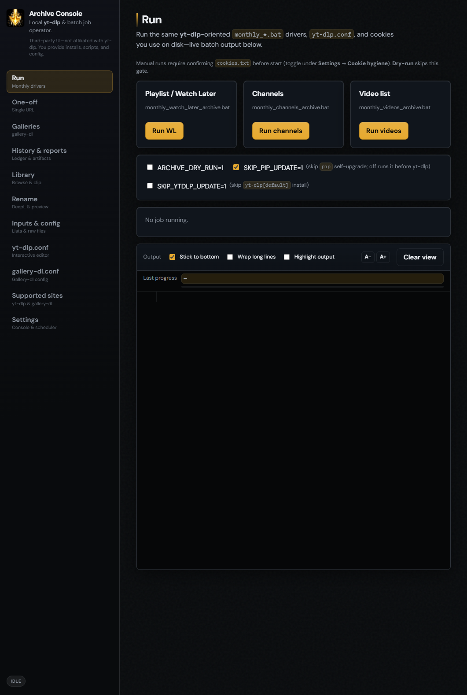

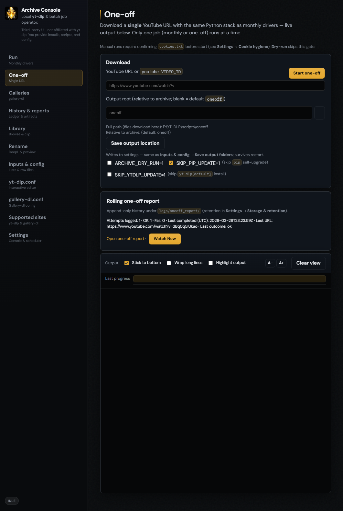

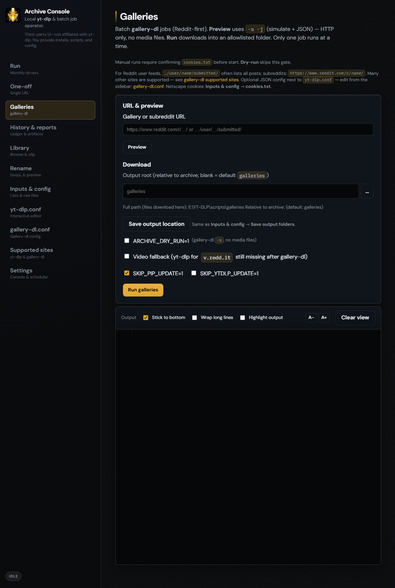

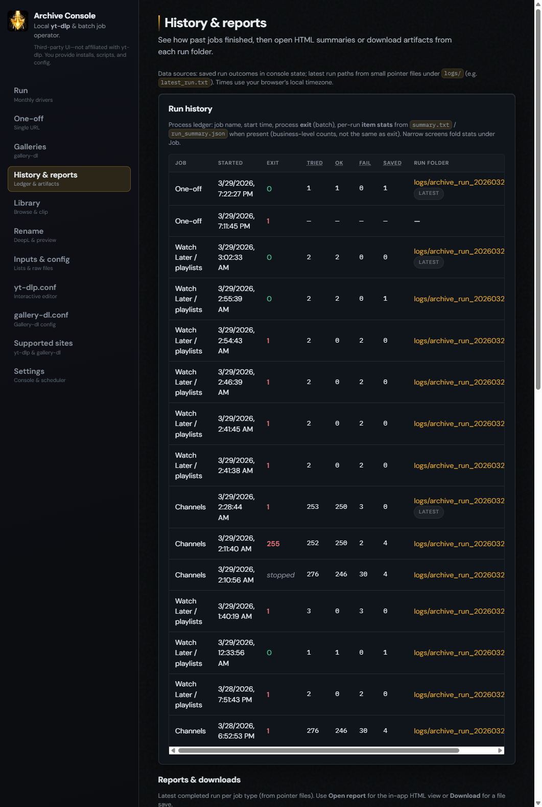

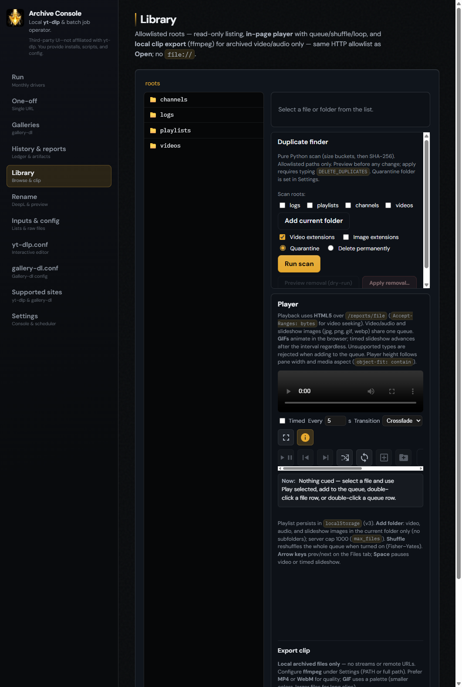

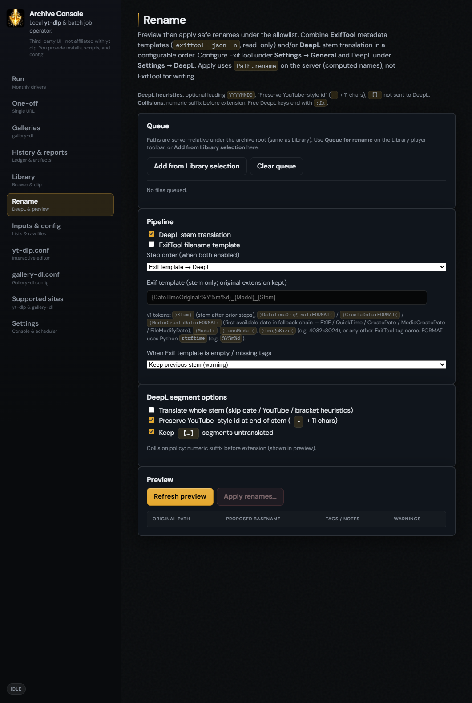

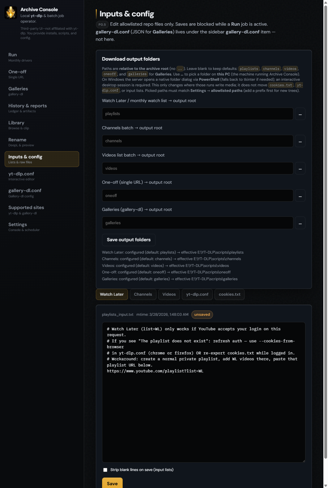

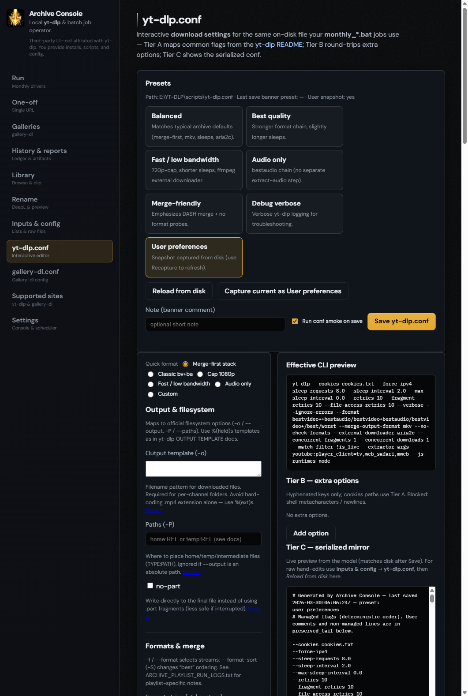

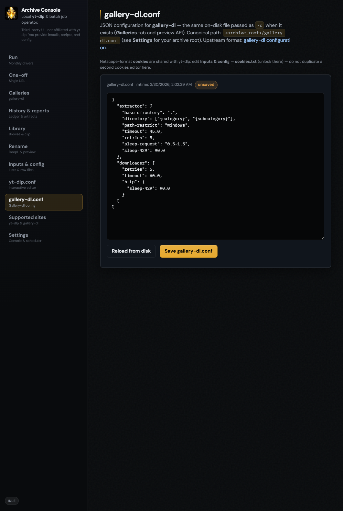

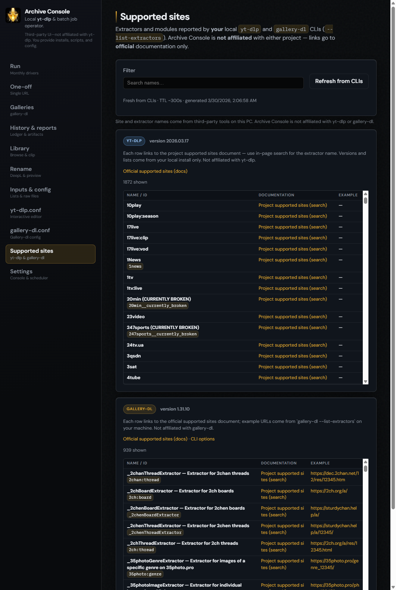

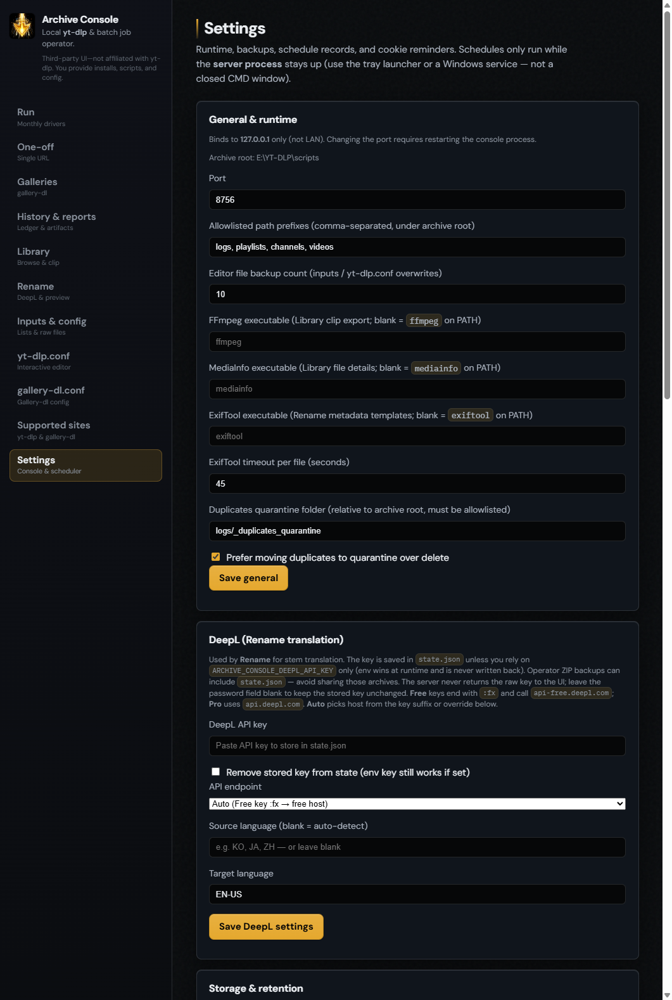

## Publishing (sanitized copy)

From your full working tree (repo root):

```bat
python tools\publish_staging.py --dest <STAGING_DEST>
```

Replace `<STAGING_DEST>` with a clean folder outside your private download trees (for example a dedicated staging directory you use only for GitHub).

Redacts typical machine paths; excludes **`cookies.txt`**, credentials, **`state.json`**, download trees (`playlists\`, `channels\`, `videos\`, `galleries\`, `oneoff\`, `cookies\`), logs, and vendored **`yt-dlp.exe`**. The output includes generated **`CONTRIBUTING.md`**, **`PUBLISH_MANIFEST.md`**, sample inputs, and placeholder legacy `.bat` stubs. See **`PUBLISH_MANIFEST.md`** in the staging folder for the full include/exclude list.

Push the staging folder to GitHub per **`GITHUB_PUBLISH.md`**. Default **`--dest`** (if omitted) is a sibling **`<name>__publish_staging`** folder.

---

**Security (Console):** loopback bind; path allowlist; **`cookies.txt`** not served as static reports; shutdown is intentional (**`SHUTDOWN`**) and may require a token—details in **ARCHIVE_CONSOLE.md**.

---

## Public snapshot notes

- **GitHub:** https://github.com/LordDemonos/archive-console — rebuilt from the operator tree with **`tools/publish_staging.py`** (see **`GITHUB_PUBLISH.md`**).
- Replace machine-specific roots with `<ARCHIVE_ROOT>` in your mind: working directory is the folder that contains `yt-dlp.conf` and the `monthly_*.bat` files.
- Copy `*.sample.txt` to `channels_input.txt`, `playlists_input.txt`, and `videos_input.txt` before running batch jobs.
- See **`CONTRIBUTING.md`**, **`PUBLISH_MANIFEST.md`**, and **`cookies.txt.example`**.

**Third-party / disclaimer:** this project is **not affiliated with YouTube, Google LLC, or yt-dlp**. You supply yt-dlp and obey site terms of service.

